# Proyecto-TJBot
## Manual del ejercicio TJBot 
### 	PROYECTO TJBOT

En esta sección vamos a construir un TJBot con el que poder mantener una conversación. [6] 

  
 

Para ello vamos a utilizar una Raspberry Pi3, la cual conectaremos a los servicios de conversación  
de Watson y así poder hacer hablar a nuestro robot.

  
 
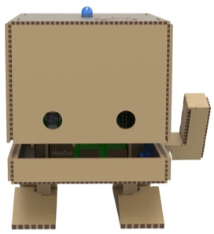    

 El objetivo final será hacer que nuestro TJBot sea capaz de mantener una conversación con nosotros y obedezca algunas órdenes.
   
<b> 1.1.	CÓMO CREAR A TJBOT </b>     
<b> 1.1.1.	RAPSBERRY PI3 </b>    

Raspberry Pi es un computador de placa única.      
Para trabajar con la Raspberry Pi3 vamos a necesitar un   
monitor, un ratón, un teclado y una fuente de  
alimentación para trabajar con ella. También debemos  
tener una tarjeta micro SD con el sistema operativo  
instalado, en este caso trabajaremos con el sistema  
operativo Raspbian.
    
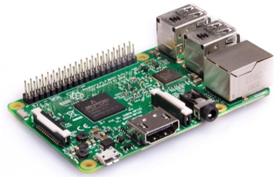   

 Para crear nuestro TJBot hace falta conectar algunos componentes más a nuestra placa: 

 
<ul> 
<li>Un micrófono</li>
<li>Un altavoz</li>
<li>Una cámara</li>
<li>Un servomotor</li>
<li>LED</li>
</ul>

    
<b> 1.2.	MONTANDO A TJBOT </b>  

 
Para comenzar a trabajar con TJBot, lo primero que debemos hacer es obtener las piezas para  
poder montarlo.
   
Este robot es DY (Do it yourself) y puede conseguirse imprimiendo las piezas en una impresora  
3D. Las piezas que se deben imprimir pueden encontrarse en la siguiente web:
      
<a href="https://ibmtjbot.github.io/#gettj"> https://ibmtjbot.github.io/#gettj</a>      
Las piezas que conseguiremos serán las siguientes:    
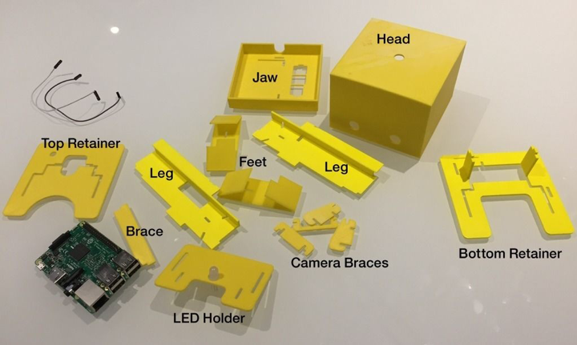      
¿Cómo lo montamos?      

 Primero, insertamos las piernas en la mandíbula. Las piernas entran en los agujeros en forma de  
 L en la mandíbula. Inserta desde la parte superior de la mandíbula hacia abajo. 
      
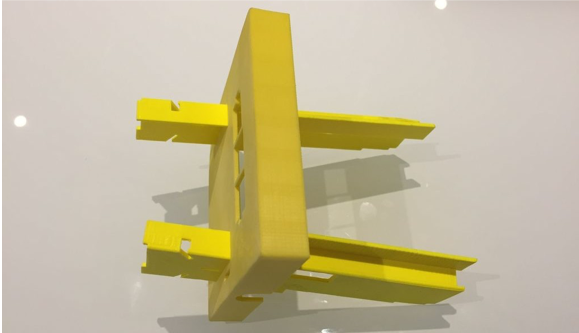      

 Después, cogemos la pieza "leg brace". Se encuentra en los dos orificios rectangulares en las  
patas debajo de la mandíbula. Mantiene las piernas rectas y soporta la mandíbula. Debemos  
 asegurar que esté orientada de modo que haga contacto con la parte inferior de la mandíbula. 
    
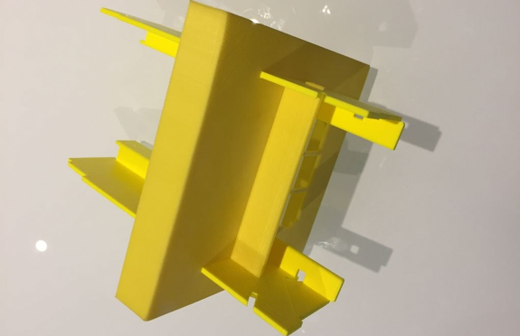      

 Ahora, cogemos los pies y los insertamos en las muescas de la pierna como se muestra a  
 continuación. Inserta los pies desde el exterior de cada pierna. 
      
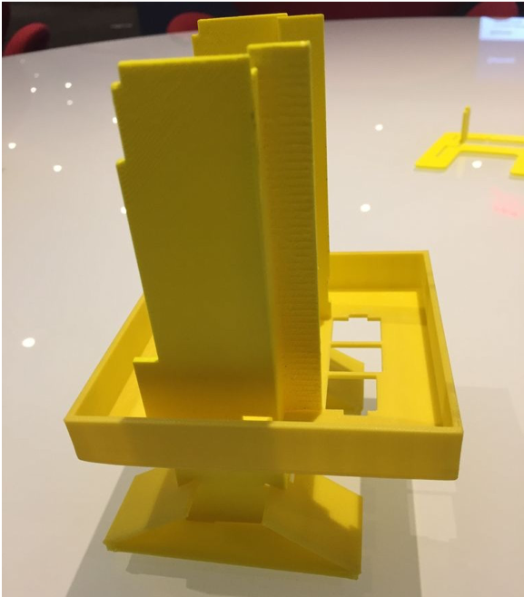      

 Si tenemos un servo motor, es hora de insertarlo en el orificio del lado izquierdo en la mandíbula.  
Cogemos el retenedor inferior y lo deslizamos hacia abajo a través de los agujeros en forma de L  
en las patas. Los brazos de soporte en la parte inferior de este retenedor deben caber en las  
 muescas de acoplamiento en la mandíbula. 
      
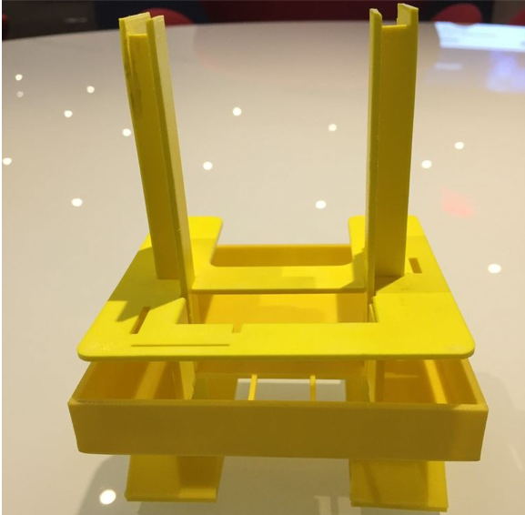      

 A continuación, insertaremos la Raspberry Pi. Se monta boca abajo, con sus puertos expuestos a  
través de los tres agujeros en la mandíbula.    
Si tenemos una cámara: tomamos el soporte de montaje de la cámara. Deslizamos los dos  
montajes laterales de la cámara en las muescas en la parte delantera del retenedor. Deslizamos  
la cámara Pi en el soporte y luego agregue los reforzadores superior y frontal para mantener la  
 cámara ajustada. 
       
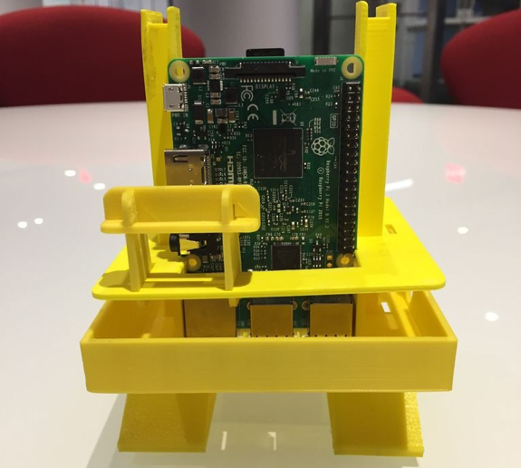      

 El siguiente retenedor es el que tiene el pequeño círculo grabado en él. Lo añadimos a TJBot  
deslizándolo a través de los orificios en forma de L, con el círculo pequeño orientado hacia la  
derecha. Deslizamos el retenedor hacia abajo hasta que se encuentre con la parte superior de la  
 Raspberry Pi.
      
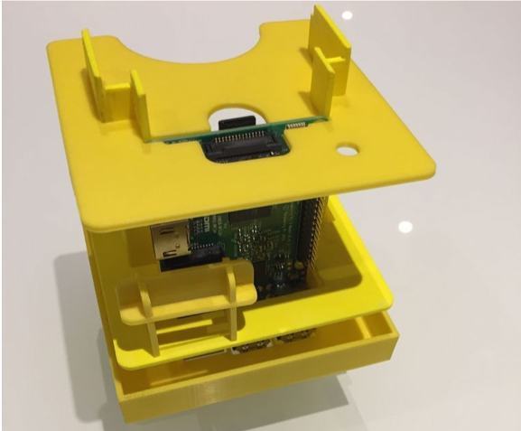      
 
 Insertamos el LED en el orificio central del retenedor pequeño. 
      
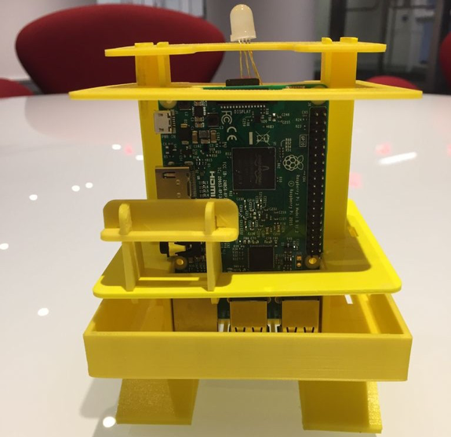      
Por último, colocamos la cabeza.      
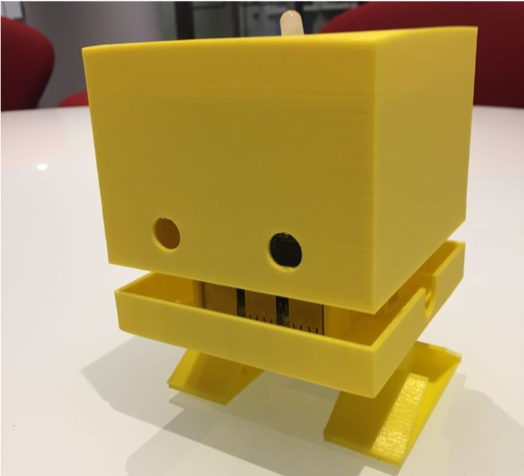      
¡Ya está listo nuestro TJBot!      

  
<b> 1.2.1. CÓMO CONECTAR LOS COMPONENTES </b>    

A continuación, se muestra un esquema de la conexión de los diferentes componentes electrónicos que forman parte de nuestro TJBot.      
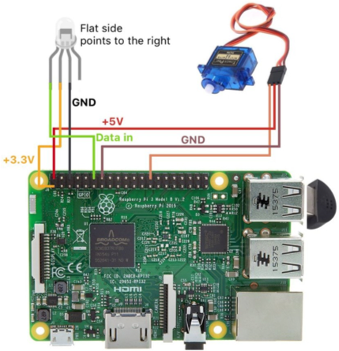    

 
